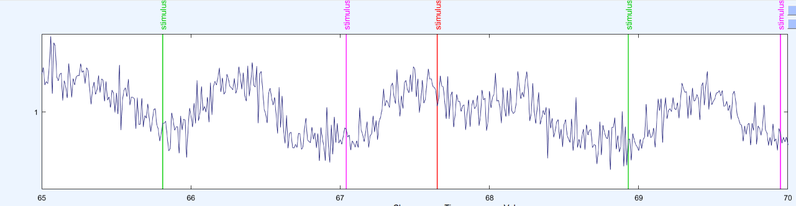

```{r setup, include=FALSE}
knitr::opts_chunk$set(cache=TRUE)
```

# Data simulation


---
```{r,include=F}
library(lme4);library(ggplot2);library(dplyr)
library(ggbeeswarm)
library(mvtnorm)
theme_set(theme_minimal(base_size = 20))
```

## Disclaimer
Lots of this presentation was taken from: Dave Kleinschmidt, Rutgers New Brunswick

[Link to his simulation slides](http://www.davekleinschmidt.com/sst-mixed-effects-simulation/simulations_slides.pdf)

## Why should we simulate?
- check your analysis pipeline
- do (pre-experiment!) power estimates
- understand statistical methods

## What are we going to do today?

- simulate a simple linear model (~1x2 ANOVA aka t-test)
- add repeated measures
- do a power analysis
- Bonus: advanced features
- Bonus: Examples

---

## A simple example to warm up
$$ y_i = b_0 + b_1*location_i + e_i$$
$$e_i \sim normal(0,\sigma) $$
```{r}
n.obs = 50   # number of subjects
b0 = 500     # how much the effect, if location=0
b1 = 50      # how much additional effect if location=1
sigma = 30   # how much noise 
beta = c(b0,b1)
data.str <- data.frame(location=factor(c(rep('low', n.obs/2), rep('high', n.obs/2))))
model.mat <- model.matrix(~ 1 + location, data.str)
sim.rt = rnorm(n=n.obs, mean = model.mat%*%beta, sd = sigma)
data = data.frame(data.str,rt=sim.rt)
```

---

```{r}
ggplot(data,aes(x=location,y=rt,color=location))+geom_beeswarm()
```

---

```{r}
summary(lm(data=data,formula = rt ~ 1 + location))
```

---

## Multiple trials
$$ y_i = (b_0 + \gamma_{0,j}) + (b_1 + \gamma_{1,j})*location_i + e_i$$
$$ \gamma_j \sim normal([0, 0],[\sigma_1, \sigma_2])$$
$$ e_i \sim normal(0,\sigma_3)$$
<center>(whiteboard-time!)</center>

---

```{r,eval=T}
beta=c(500,50);sigma=200
gamma = diag(c(100^2,50^2)) # variation over subjects
n.subj=24;n.obs=50

# create design matrix for our made up experiment
data.str <- data.frame(location=factor(c(rep('low', n.obs/2), rep('high', n.obs/2))))
model.mat <- model.matrix(~ 1 + location, data.str)

# repeat for every subject (rdply):
generate.data <- function() {
  simulated.data <- plyr::rdply(n.subj, {
    beta <- t(rmvnorm(n=1,mean = beta, sigma=gamma))
    expected.rt <- model.mat %*% beta
    sim.rt <- rnorm(n=length(expected.rt), mean=expected.rt, sd=sigma)
    data.frame(data.str, rt=sim.rt)
  })
  names(simulated.data)[1] <- 'subject'
  return(simulated.data)
}


```

----

```{r}
ggplot(generate.data(),aes(x=location,y=rt,color=location))+geom_beeswarm()
```

---

```{r}
summary(lm(data=generate.data(),formula = rt ~ 1 + location))
```
---

```{r}
ggplot(data = generate.data(),aes(x=subject,y=rt,color=location))+geom_beeswarm(dodge.width = 0.5)
```

---

```{r}
summary(lmer(data=generate.data(),formula = rt ~ 1 + location + (1|subject)))
```
---

## Power analyses!
- run the function 1000 time & look at results
- to make it more realistic we add a little bit to the pipeline
```{r eval=T,echo=T}
runAnalysis = function(simulated.data){
  # Outlier correction (winsorizing)
  simulated.data <- simulated.data %>%
  group_by(subject)%>%
    mutate(cut_point_top   = quantile(rt, 0.9),
          cut_point_bottom = quantile(rt, 0.1))

  simulated.data$rt <- with(simulated.data,
                              ifelse(rt>cut_point_top, cut_point_top, 
                              ifelse(rt<cut_point_bottom, cut_point_bottom, rt)))

  results = lmer(data=simulated.data,formula = rt ~ 1 + location + (1|subject))
  return(broom::tidy(results,'fixed'))
}

```

```{r eval=T,echo=F}
library(mvtnorm)
make.data.generator <- function(true.effects=c(0,0),resid.sd=1,
                                ranef.cor=matrix(c(1,0.4,0.4,1),ncol = 2),
                                ranef.cov=diag(2),
                                n.subj=24,n.obs=50, lognormal = F)
{
  # create design matrix for our made up experiment
  data.str <- data.frame(location=factor(c(rep('low', n.obs/2), rep('high', n.obs/2))))

    model.mat <- model.matrix(~ 1 + location, data.str)
  generate.data <- function() {
    # sample data set under mixed effects model with random slope/intercepts
    simulated.data <- plyr::rdply(n.subj, {
      beta <- t(rmvnorm(n=1, sigma=ranef.cov%*%ranef.cor%*%ranef.cov)) + true.effects
      expected.RT <- model.mat %*% beta
      if(lognormal){
         sim.RT <- rlnorm(n=length(expected.RT), meanlog =log(expected.RT), sdlog=log(resid.sd))
      }else{
         sim.RT <- rnorm(n=length(expected.RT), mean=expected.RT, sd=resid.sd)
      }
      data.frame(data.str,
                 rt=sim.RT)
    })
    names(simulated.data)[1] <- 'subject'
    simulated.data
  }
}
```

---

```{r, eval=F,include=F}
# old but interesting function to compare multiple different random-designs

library(lme4);library(ggplot2);library(dplyr)
#data = read_data()

runAnalysis = function(data){
  data$location = as.numeric(data$location)-1
  res.base     = lmer(rt ~ 1+(1|subject),data=data)
  res.simple   = lmer(rt ~ 1+location+(1|subject),data=data)
  res.ranslope = lmer(rt ~ 1+location+(1|subject)+(0+location|subject),data=data)
  res.ranevery = lmer(rt ~ 1+location+(1+location|subject),data=data)

  #anovatable = (anova(res.base,res.simple,res.ranslope,res.ranevery))
  return(gdata::combine(broom::tidy(res.simple,'fixed'),broom::tidy(res.ranslope,'fixed'),broom::tidy(res.ranevery,'fixed')))
}
#runAnalysis(data)
```


```{r}

simulations <- plyr::rdply(.n=1000,
                runAnalysis(generate.data()))
head(simulations)
```

---

```{r}
ggplot(simulations,aes(x=statistic))+geom_histogram(aes(y = ..density..))+geom_density(size=2)+facet_grid(. ~term,scales = "free_x")
```

---

```{r}
simulations %>%
  group_by(term)%>%
  summarise(sigRate=mean(abs(statistic)>1.96))
```

# Bonus material

---

## Spicing things up:
```{r, eval=F}
# make RT lognormal
sim.RT <- rlnorm(n=length(expected.RT), meanlog =log(expected.RT), sdlog=log(resid.sd))
sim.RT <- rnorm (n=length(expected.RT), mean=expected.RT, sd=resid.sd)

# add sequential effects
simulated.data%>%group_by(subject)%>%
  mutate(rt = c(rt[1],rt[2:length(rt)] + 0.1*rt[1:length(rt)-1]))
```

---

```{r,warning=F,message=F,fig.height=3}
simulated.data         = make.data.generator(true.effects=c(500,0),resid.sd=200 ,lognormal=F,ranef.cov = diag(c(100,0)))
simulated.data_lognorm = make.data.generator(true.effects=c(500,0),resid.sd=1.45,lognormal=T,ranef.cov = diag(c(100,0)))

simulated.data_seq = function(simulated.data){
  simulated.data()%>%group_by(subject)%>%
  mutate(rt = c(rt[1],rt[2:length(rt)] + 0.1*rt[1:length(rt)-1]))
}

ggplot(bind_rows(simulated.data(),simulated.data_seq(simulated.data),simulated.data_lognorm(),.id="condition"),aes(x=location,y=rt)) +geom_beeswarm(aes(color=location))+ stat_summary(size=1)+facet_grid(.~condition)
```

----

```{r,warning=F,message=F}
n_sim = 2000
simulations = bind_rows(plyr::rdply(.n=n_sim,
                runAnalysis(simulated.data())),
          plyr::rdply(.n=n_sim,
                runAnalysis(simulated.data_seq(simulated.data))),      
          plyr::rdply(.n=n_sim,
                runAnalysis(simulated.data_lognorm())),.id="condition")
```

```{r,warning=F,fig.height=3,message=F}
ggplot(simulations,aes(x=statistic,color=condition))+
  geom_density(size=2)+facet_grid(. ~term,scales = "free_x")
```

--- 

```{r}

simulations %>%
  group_by(term,condition)%>%
  summarise(sigRate=mean(abs(statistic)>1.96))
```


# Other examples

---

## Timeseries

{width=400px}

---

```{r eval=F}
[...]
# generate sigmoids as change points
custom_interp = function(w,wc,w2,a)
    return((w2 + wc) * a[1] +  (w - w2) * a[2]);
w = arm::invlogit(2*(seq(ntime) - 12))
w2 = arm::invlogit(2*(seq(ntime) - 30))
wc = 1-w

# the mean curve is a combination of the sigmoids and the means
mu = custom_interp(w,wc,w2,c(0,5))
sigma = custom_interp(w,wc,w2,c(1,1.5))
for (t in seq(length(timevec))){
  for (t in seq(length(timevec))){      
    # autocorrelation of total signal + correlation of noise    
    predssvep = mu[t] + autocorr * predssvep_n1 + theta*err
    ssvepnoise = rnorm(1,0,sigma[t])
    
    predssvep = predssvep + ssvepnoise;
    predssvep_n1 = predssvep
    err = ssvepnoise
}
```

---

## EEG Signal

{width=400px}

---
```{matlab eval=F}
T_event= 500; % total length of event-signal in samples
N_event = 500; % max number of events
EEG = eeg_emptyset();
EEG.pnts  = 5000; % total length in samples
EEG.srate = 1000; %Hz

% first signal is 1/4 flat, then pink noise then 1/4 flat
sig1 = pinknoise(T_event)';
sig1(1:T_event/5) = 0;
sig1(4*T_event/5:end) = 0;

event_lat = ceil(cumsum(250+50*randn(N_event,1)));
event_lat(event_lat>EEG.pnts-T_event) = [];

for e = 1:length(event_lat)
    EEG.event(e).latency = event_lat(e);
    EEG.event(e).type = 'eventA';
end

% generate signal
tmp = zeros(1,EEG.pnts);
tmp(event_lat) = 1;
sig1_tmp = conv(tmp,sig1,'full');

EEG.data(1,:) = sig1_tmp(1:EEG.pnts);
EEG.data = EEG.data + 0.5*rand(size(EEG.data));
```


---

## EEG coherence

 - have a forward model (source voxel => electrode space)
 - have some sinoidal signal
 - use two voxels and project phase-shifted sinoidal signal to electrodes
 - sprinkle some noise on top of it
 
---

```{matlab eval=F}
function [raw] =p2_be_simulateData5(subjID,varargin)
% [...]

    for k = 1:length(randSources)
        tIdx = randi(g.srate*0.25+length(g.time)-4*g.srate*0.25);
        tIdx = tIdx:tIdx + round((rand(1)/2 + 0.25) *g.srate);
        phase = rand(1,g.ntrials).*2.*pi;
        freq = randi([1 80]);
        for nT = 1:g.ntrials
            wind = hamming(length(tIdx));
            simSig = sin(freq*g.time(tIdx)*2*pi + phase(nT));
            sig(end,tIdx)= wind .* simSig';
        end
    end
% [...]
raw = ft_dipolesimulation(cfg);

```
</p>
</div>
